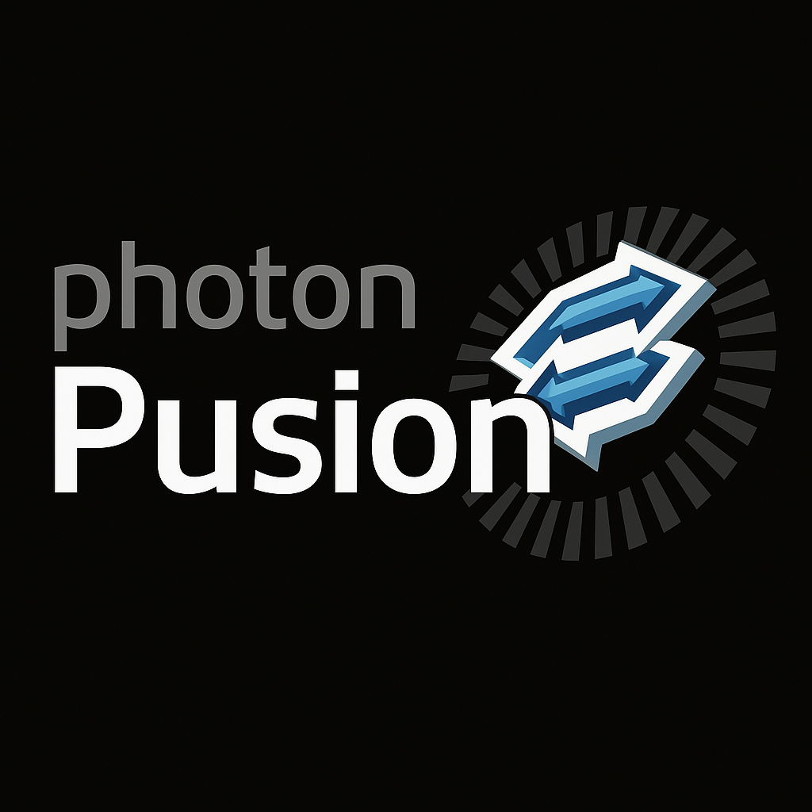

# Photon Pusion



**Photon Pusion** is a Unity package designed to mimic the Photon Unity Networking (PUN) syntax while utilizing Photon Fusion under the hood. It provides a seamless bridge between the familiar PUN workflow and the powerful capabilities of Photon Fusion, allowing developers to easily switch between the two.

---

## Features

- **PUN Syntax Compatibility**: Photon Pusion ensures that you can continue using the PUN syntax while enjoying the benefits of Photon Fusion.
- **High Performance**: Built to scale efficiently with Photon Fusion's advanced features, enabling smooth multiplayer experiences.
- **Flexibility**: Seamless integration into existing PUN-based projects, making transitioning to Photon Fusion easier than ever.
  
---

## Setup Guide

To get started with Photon Pusion, follow these steps:

### Prerequisites
- **Unity** (version 2020.3 or newer recommended)
- **Photon Fusion** installed (make sure to follow [Photon Fusion setup](https://doc.photonengine.com/en-us/fusion/current/getting-started/intro) before integrating Photon Pusion)

### Installation
1. **Import the Photon Pusion Package**:
   - Download the latest release from [Photon Pusion GitHub](#) or import directly via Unity Package Manager by adding the Git URL: `https://github.com/yourusername/PhotonPusion.git`.

2. **Configure Your Project**:
   - After importing the package, drag and drop the **Photon Pusion Prefab** into your scene to set up the necessary Photon Fusion components.
   
3. **Network Settings**:
   - Ensure you have the correct **Photon Fusion settings** configured in your project.
   - Go to **Window > Photon Fusion > Settings** to adjust your connection settings.

4. **Start Using Photon Pusion**:
   - Use **PhotonPusionNetworkManager** in your scripts and integrate with the standard PUN API, just like you would normally do with Photon PUN.

---

## Perks and Difficulty Scale

Here’s a breakdown of the **perks** and **difficulty** associated with using Photon Pusion, rated on a scale of **1 to 100**:

### Perks

| Feature                           | Rating (1-100) |
|-----------------------------------|----------------|
| **Easy Migration from PUN**       | 90             |
| **Power of Photon Fusion**        | 95             |
| **Networking Performance Boost**  | 85             |
| **Reduced Code Complexity**       | 75             |
| **Customizability**               | 80             |

### Difficulty

| Aspect                            | Rating (1-100) |
|-----------------------------------|----------------|
| **Learning Curve**                | 60             |
| **Integration into Existing PUN Projects** | 50       |
| **Understanding Photon Fusion**   | 70             |
| **Debugging and Troubleshooting** | 55             |
| **Customizing Advanced Features** | 80             |

---

## Example Code

Here’s an example of using Photon Pusion with basic networking:

```csharp
using Photon.Pusion;

public class MyNetworkedObject : PusionNetworkObject
{
    public override void OnPhotonInstantiate(PhotonMessageInfo info)
    {
        Debug.Log("Object Instantiated with Photon Pusion!");
    }

    void Start()
    {
        if (PhotonNetwork.IsConnected)
        {
            Debug.Log("Connected to Photon Pusion network!");
        }
    }
}
